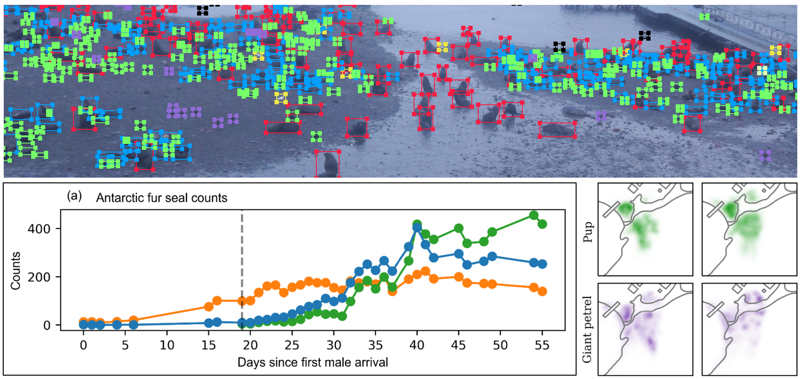

# Fine-scale spatiotemporal predator-prey interactions in an Antarctic fur seal colony

[](https://doi.org/10.5281/zenodo.18141470)
[](https://opensource.org/licenses/MIT)

## Description
This repository contains the code and analysis workflow for the paper **"Fine-scale spatiotemporal predator-prey interactions in an Antarctic fur seal colony"**. It includes the neural network training pipeline (YOLO-based) and the downstream ecological analysis of predator-prey spatial dynamics.

<p align="center">
  
</p>


## Abstract
Density critically shapes population dynamics, with high densities exacerbating intraspecific competition and disease transmission, while low densities increase predation risk. To investigate spatiotemporal density patterns and predator-prey interactions in an Antarctic fur seal (*Arctocephalus gazella*) colony, we deployed an autonomous camera that captured minute-by-minute high-resolution images throughout a breeding season. Using a YOLO-based neural network, we identified adult males, females and pups, and avian predator-scavenger species: giant petrels (*Macronectes* spp.), brown skuas (*Stercorarius antarcticus*) and snowy sheathbills (*Chionis alba*). Analysing a dataset of 4.1 million automated detections from over 10,000 high-quality images, we found spatiotemporal abundance patterns corresponding with the known foraging and breeding behaviours of these species. Strong temporal associations also emerged between the abundance of pups and two of the avian species. Fine-scale spatial analyses further revealed that pups typically remained near other pups and adult females but avoided avian predators and territorial males. Notably, the proximity of adult fur seals of both sexes reduced pup predation risk, defined as the distance between the pup and the nearest bird, whereas proximity to other pups did not. This study provides a framework for studying density-dependent interactions in wild populations and highlights the value of remote observation in ecological research.

## Authors
Ane Liv Berthelsen [](https://orcid.org/0000-0001-6718-6709), 
Johannes Bartl [](https://orcid.org/0009-0003-3647-2472), 
Alexander Winterl [](https://orcid.org/0000-0003-0688-9317), 
Cameron Fox-Clarke, 
Jaume Forcada [](https://orcid.org/0000-0002-2115-0150), 
Rebecca Nagel [](https://orcid.org/0000-0002-2925-1028), 
Ben Fabry [](https://orcid.org/0000-0003-1737-0465), 
Joseph Ivan Hoffman [](https://orcid.org/0000-0001-5895-8949)

## Installation

### Prerequisites
* Python: 3.8.10
* python packages listed in requirements.txt
* Hardware: NVIDIA GeForce RTX 3070 (8GB VRAM)
* CUDA Toolkit: 11.2 (Required for reproducibility)
* NVIDIA Driver: 575.51 (Supports CUDA 11.2+)

### Setup
1.  Clone the repository:
    ```bash
    git clone https://github.com/fabrylab/AntarcticFurSealPredatorPrey.git
    cd AntarcticFurSealPredatorPrey
    ```
2.  Install dependencies:
    ```bash
    pip install -r requirements.txt
    ```

*Note: The data annotation was performed using [ClickPoints](https://clickpoints.readthedocs.io/en/latest/).*

## Data & Model Setup

To reproduce the results, you must first download the dataset and pre-trained weights from Zenodo.

1.  **Download Data:**
    *  Go to [10.5281/zenodo.18141470](https://doi.org/10.5281/zenodo.18141470)
    * Download `data.zip`, `model.h5`, `automated_detections`.csv and `manual_detections.csv`.
2.  **Unpack:**
    * Unzip `data.zip` into the repository root.
    * Place `model.h5` in the repository root.
    * Place `automated_detections.csv` and `manual_detections.csv` in the files folder
3.  **Directory Structure:**
    Ensure your folder looks like this:
    ```text
    .
    ├── data/                       # Unzipped image dataset
    │   ├── image.JPG
    │   ├── image.cdb           # ClickPoints database files
    │   └── ...                     # Remaining images and databases
    ├── files/                      # Detection data
    │   ├── automated_detections.csv
    │   └── manual_detections.csv
    ├── assets/                     # Documentation images (optional)
    │   └── cover.png
    ├── model.h5                    # Neural network weights
    ├── train.ipynb                 # Training pipeline
    ├── analyze.ipynb               # Ecological analysis
    ├── requirements.txt            # Python dependencies
    └── README.md                   # Project documentation
    ```

## Usage

### 1. Training (`train.ipynb`)
Run this notebook to retrain the network or finetune the model. 
* Follow the comments provided within the notebook.
* Ensure the data directory is correctly linked.

### 2. Analysis (`analyze.ipynb`)
This notebook contains the entire ecological data analysis presented in the paper.
* Generates the spatiotemporal plots and predator-prey interaction statistics.
* Input: The detection data (CSV/dataframe) produced by the network.

## Contact

For questions regarding the code, dataset, or the biological analysis, please contact the authors:

*  - [**Ane Liv Berthelsen**](https://thehoffmanlab.com/group/ane-liv-berthelsen/)
*  - [**Johannes Bartl**](https://bio.physik.fau.de/person/johannes-bartl/)
  
If you encounter bugs in the code, please feel free to [open an issue](https://github.com/fabrylab/AntarcticFurSealPredatorPrey/issues) in this repository.

